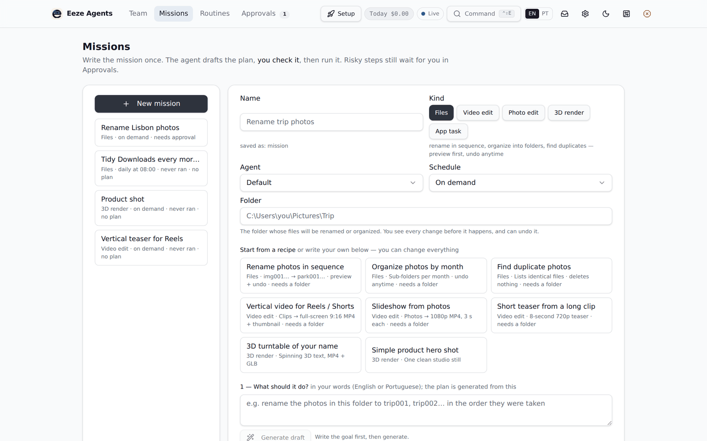
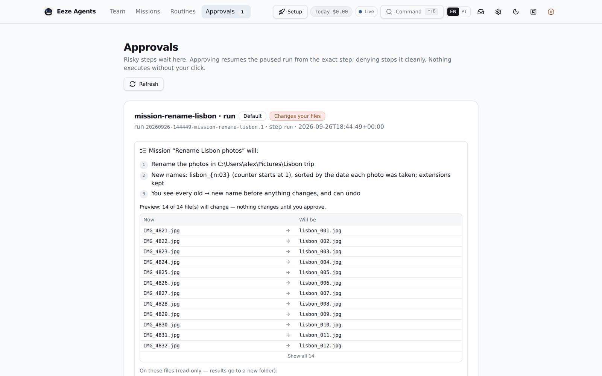

# Eeze Agent

**A computer-use agent that runs on your own Windows PC.** You describe a job in plain words —
"cut this clip into a vertical 30-second teaser", "rename these 80 photos park001, park002…",
"render a product shot in Blender" — Eeze plans it, shows you exactly what it will do, waits for
your approval, and then does it in the background with the apps you already have.

🇧🇷 [Leia em português](README.pt-BR.md)





- **Local first.** The service and dashboard live on `127.0.0.1`. Your files never leave your
  computer unless a job you approve sends something to an AI provider you configured.
- **You approve the risky parts.** Anything that changes or removes files, spends money or
  sends something out stops and asks. File changes come with a preview and a one-click undo.
- **Guard rails built in.** Daily spending cap for paid AI calls, approvals that expire,
  reminders, and a full audit trail of every run.

## What it can do today

| Mission | What you get |
| --- | --- |
| Video | Trim, join, add titles/logo, vertical 9:16 cuts (ffmpeg) |
| Photo | Crop, resize, square/vertical formats, simple edits (ffmpeg) |
| Files | Rename in sequence, organize by date/type, find duplicates — preview + undo; or watch a folder and propose the batch whenever new files arrive |
| 3D | Simple Blender scenes and renders |
| Invoices | Pull invoice data from PDFs into a table |
| Routines | Any of the above on a schedule |

It is an early open-source project: expect rough edges. See [docs/CAPABILITIES.md](docs/CAPABILITIES.md).

## Install (Windows 10/11 — no terminal needed)

1. Download this repository (green **Code** button → **Download ZIP**) and unzip it somewhere
   permanent, e.g. `C:\Users\<you>\eeze-agent`. Or `git clone` it.
2. Double-click **`install.cmd`**.

The installer sets up Python (via [uv](https://docs.astral.sh/uv/)), builds the dashboard
(installing Node.js LTS with `winget` on a fresh PC), installs [ffmpeg](https://ffmpeg.org/)
if it is missing, starts the background service, creates shortcuts and **opens Eeze in your
browser already signed in**. The first run takes a few minutes.

**You need an AI provider** to turn your words into a plan: the setup page lets you paste a key
for OpenRouter, OpenAI, Google, xAI or Groq, point Eeze at a local [Ollama](https://ollama.com),
or route every call through [Sabi](#partner-sabi).
Planning a mission costs cents; running files/video/photo missions uses no AI at all.
Optional: [Blender](https://www.blender.org/) for 3D missions.

### Everyday use

| You want to… | Do this |
| --- | --- |
| Open Eeze | Double-click **Eeze Agent** on the Desktop or Start menu |
| Install an update | `git pull` (or download the new ZIP and unzip it over the same folder), then Start menu → **Eeze Agent - Update** |
| Sign every browser out | `eeze unpair` (see below) |

The service starts with Windows so scheduled routines run, and a watchdog restarts it if it stops.

## Partner: Sabi

Eeze works with **[Sabi](https://github.com/vizuh/sabi)** — adaptive inference scheduling for AI
agents. Instead of one fixed model, Sabi decides the model, reasoning effort and provider for
every call, so simple steps stay cheap and hard ones get a stronger model.

1. Run Sabi on the same computer (Node 22.6+): `npm install`, then `npm start`. It listens on
   `http://127.0.0.1:8787/v1`.
2. In Eeze: **Settings → Providers & models → Sabi → Test connection → Use this one.**

Eeze sends Sabi's routing alias `sabi-code`; keys for the models live in Sabi's own configuration.

## Signing in (pairing)

Eeze's dashboard can see your runs and approve actions on your computer, so a browser has to
be **paired** once before it can use it. You normally never notice this:

- **The installer and the "Eeze Agent" shortcut pair the browser for you.** They open a link
  with a one-time code that works once, for two minutes, only on this computer.
- A paired browser stays signed in for **30 days** (change with `EEZE_SESSION_DAYS`).

If you ever land on the **"Sign in this browser"** page, just double-click the Eeze Agent
shortcut. The manual way, the security model and troubleshooting are in
**[docs/PAIRING.md](docs/PAIRING.md)**.

## For developers

```bash
uv sync                      # create/refresh .venv
uv run pytest                # tests
uv run eeze doctor           # environment self-check
uv run eeze api start        # background API + dashboard on http://127.0.0.1:8765 (stop/status)
uv run eeze open             # open the dashboard already paired
uv run eeze ui build         # rebuild the dashboard (ui/)
```

Copy `.env.example` to `.env` for optional overrides (AI keys can also be entered in the app).
Dashboard development with hot reload: `EEZE_DEV_ORIGINS=1` + `cd ui && npm run dev`.
More in [docs/DEVELOPMENT.md](docs/DEVELOPMENT.md), [docs/ARCHITECTURE.md](docs/ARCHITECTURE.md)
and [docs/API.md](docs/API.md).

```
src/eeze_agent/   service: core loop, brains, drivers, safety, verticals, API
ui/               dashboard (React 19 · TanStack · Tailwind v4)
docs/             architecture, API, decisions (ADRs)
tests/            pytest suite
```

## Security

Please report vulnerabilities privately — see [SECURITY.md](SECURITY.md).

## License

[Apache License 2.0](LICENSE).
