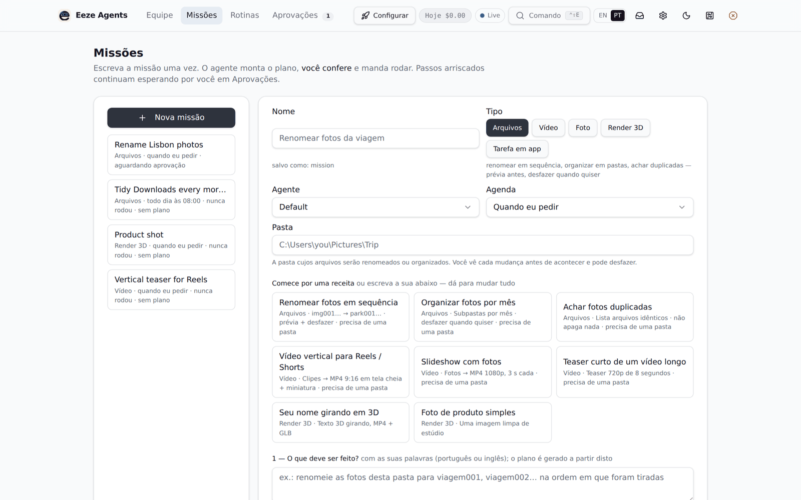
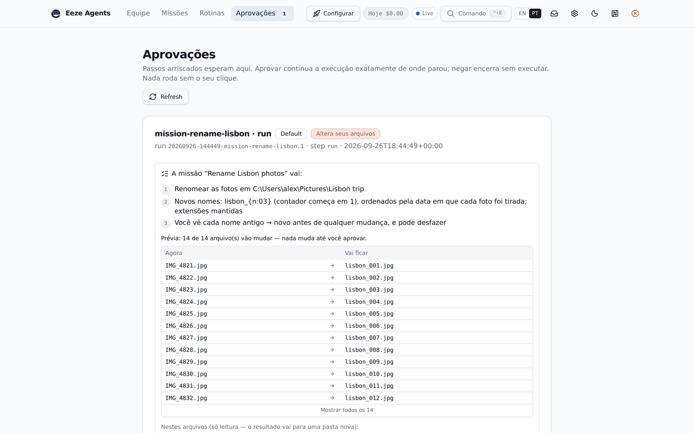

# Eeze Agent

**Um agente que usa o computador por você, rodando no seu próprio PC Windows.** Você descreve
o trabalho com palavras simples — "corte este vídeo num teaser vertical de 30 segundos",
"renomeie estas 80 fotos para parque001, parque002…", "renderize uma foto de produto no
Blender" — o Eeze planeja, mostra exatamente o que vai fazer, espera a sua aprovação e faz em
segundo plano, com os programas que você já tem.

🇺🇸 [Read in English](README.md)

- **Local.** O serviço e o painel ficam em `127.0.0.1`. Seus arquivos não saem do computador,
  a não ser que um trabalho aprovado por você envie algo ao provedor de IA que você configurou.
- **Você aprova o que é arriscado.** Tudo que altera ou apaga arquivos, gasta dinheiro ou envia
  algo para fora para e pergunta. Mudanças em arquivos vêm com prévia e desfazer em um clique.
- **Proteções embutidas.** Limite diário de gasto com IA paga, aprovações que expiram,
  lembretes e histórico completo de cada execução.

## O que ele faz hoje

| Missão | Resultado |
| --- | --- |
| Vídeo | Cortar, juntar, títulos/logo, versões verticais 9:16 (ffmpeg) |
| Foto | Recortar, redimensionar, quadrado/vertical, edições simples (ffmpeg) |
| Arquivos | Renomear em sequência, organizar por data/tipo, achar duplicados — com prévia e desfazer; ou monitorar uma pasta e propor o lote sempre que chegam arquivos novos |
| 3D | Cenas e renders simples no Blender |
| Notas fiscais | Extrair dados de PDFs para uma tabela |
| Rotinas | Qualquer um dos itens acima, agendado |

É um projeto open source em estágio inicial: espere arestas. Veja [docs/CAPABILITIES.md](docs/CAPABILITIES.md).

## Instalação (Windows 10/11 — sem terminal)

1. Baixe este repositório (botão verde **Code** → **Download ZIP**) e descompacte num lugar
   definitivo, por exemplo `C:\Users\<você>\eeze-agent`. Ou use `git clone`.
2. Dê dois cliques no **`install.cmd`**.

O instalador prepara o Python (via [uv](https://docs.astral.sh/uv/)), monta o painel
(instalando o Node.js LTS com `winget` num PC novo), instala o [ffmpeg](https://ffmpeg.org/) se
faltar, liga o serviço em segundo plano, cria atalhos e **abre o Eeze no navegador já
conectado**. A primeira vez leva alguns minutos.

**Você precisa de um provedor de IA** para transformar suas palavras num plano: na
configuração, cole uma chave da OpenRouter, OpenAI, Google, xAI ou Groq, aponte para um
[Ollama](https://ollama.com) local, ou passe todas as chamadas pelo [Sabi](#parceiro-sabi). Planejar uma missão custa centavos; rodar missões de
arquivos/vídeo/foto não usa IA nenhuma. Opcional: [Blender](https://www.blender.org/) para 3D.

### Uso no dia a dia

| Você quer… | Faça isto |
| --- | --- |
| Abrir o Eeze | Dois cliques em **Eeze Agent** na Área de Trabalho ou no menu Iniciar |
| Instalar uma atualização | `git pull` (ou baixe o ZIP novo e descompacte por cima na mesma pasta), depois Menu Iniciar → **Eeze Agent - Update** |
| Desconectar todos os navegadores | `eeze unpair` (veja abaixo) |

O serviço inicia com o Windows para as rotinas rodarem, e um vigia o reinicia se ele parar.

## Parceiro: Sabi

O Eeze funciona com o **[Sabi](https://github.com/vizuh/sabi)** — agendamento adaptativo de
inferência para agentes de IA. Em vez de um modelo fixo, o Sabi escolhe o modelo, o nível de
raciocínio e o provedor a cada chamada: passos simples ficam baratos e os difíceis ganham um
modelo mais forte.

1. Rode o Sabi no mesmo computador (Node 22.6+): `npm install` e depois `npm start`. Ele fica
   em `http://127.0.0.1:8787/v1`.
2. No Eeze: **Configurações → Provedores e modelos → Sabi → Testar conexão → Usar este.**

O Eeze envia o apelido de roteamento `sabi-code`; as chaves dos modelos ficam na configuração do
próprio Sabi.

## Conectar o navegador (pareamento)

O painel do Eeze vê suas execuções e aprova ações no seu computador, por isso o navegador
precisa ser **conectado** uma vez antes de usar. Normalmente você nem percebe:

- **O instalador e o atalho "Eeze Agent" conectam o navegador sozinhos.** Eles abrem um link
  com um código que vale uma única vez, por dois minutos, só neste computador.
- Um navegador conectado fica assim por **30 dias** (ajuste com `EEZE_SESSION_DAYS`).

Se um dia você cair na página **"Conecte este navegador"**, é só dar dois cliques no atalho
Eeze Agent. O jeito manual, o modelo de segurança e a solução de problemas estão em
**[docs/pt-BR/PAIRING.md](docs/pt-BR/PAIRING.md)**.

## Para desenvolvedores

Veja a seção *For developers* do [README em inglês](README.md#for-developers).

## Segurança

Relate vulnerabilidades de forma privada — veja [SECURITY.md](SECURITY.md).

## Licença

[Apache License 2.0](LICENSE).
